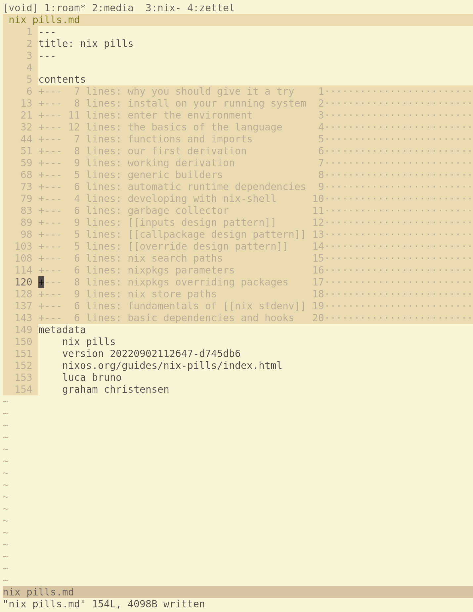
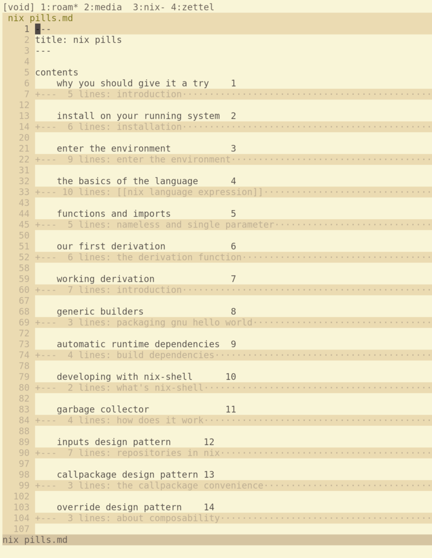
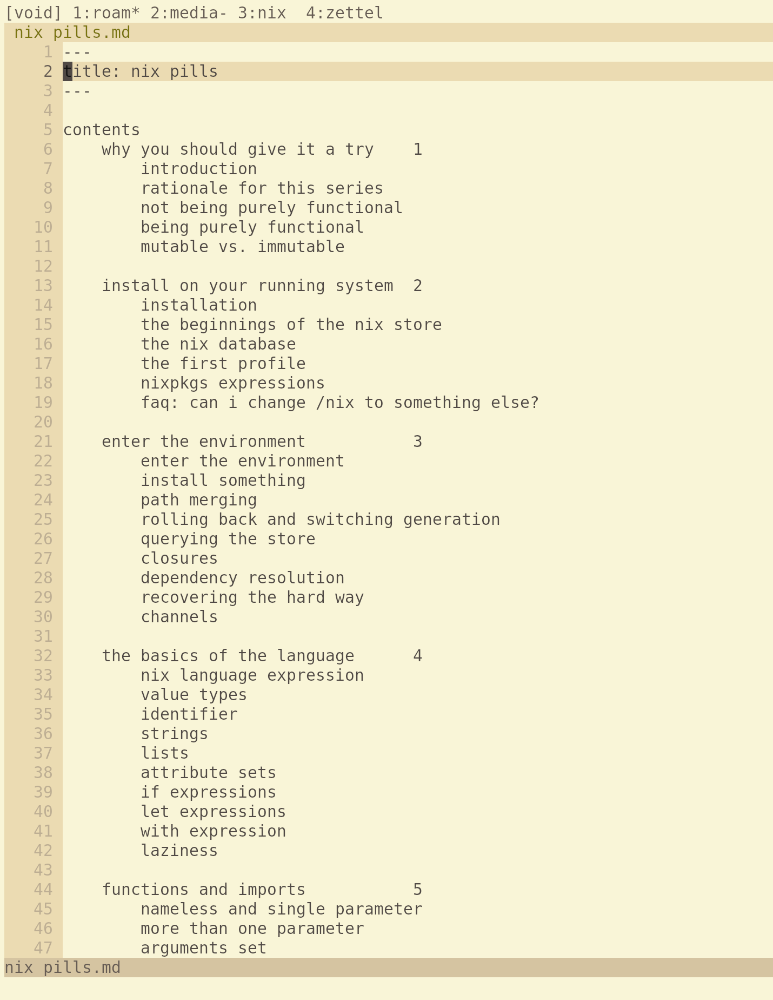

# Table of Contents

This is a table of contents for your project. It helps the reader navigate through the README quickly.
- [Quick Start Demo](#quick-start-demo)
- [Table of Contents](#table-of-contents)
- [Installation](#installation)
- [Usage](#usage)
- [Development](#development)
- [Contribute](#contribute)
- [License](#license)

# Quick Start Demo

# Usage

Next, you have to explain how to use your project. You can create subsections under here to explain more clearly.

# Status

    

