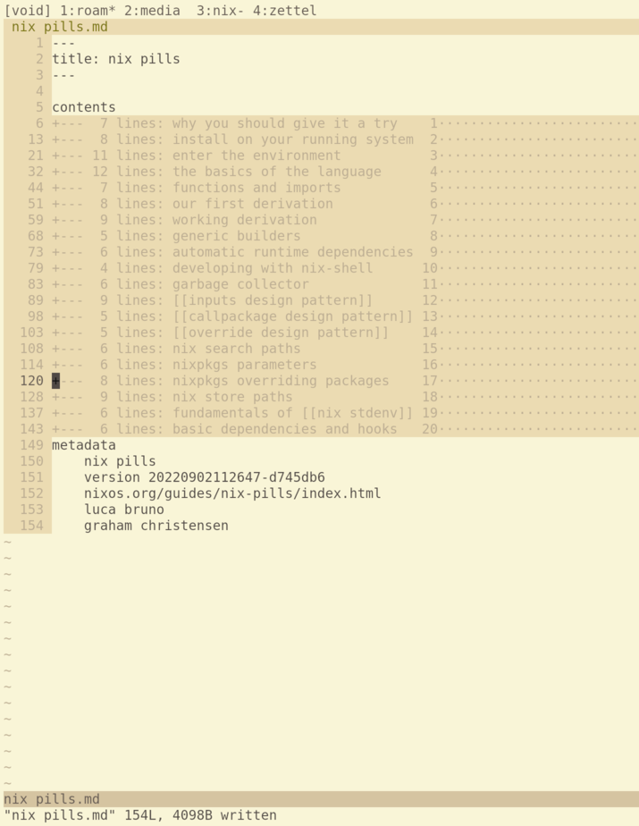

# Table of Contents

This is a table of contents for your project. It helps the reader navigate through the README quickly.
- [Quick Start Demo](#quick-start-demo)
- [Table of Contents](#table-of-contents)
- [Installation](#installation)

# Quick Start Demo

This is a simple vim plugin which defines a fold expression for the option
`foldexpr` for a filetype I'm calling `zettel`, which relies only on indentation
for folding.

From this original file, the difference in fold behavior can be seen

## Original

## Default Fold

## Custom Fold

# Installation

## nix
This repo defines an overlay, so you can add the overlay to your nixpkgs and
then import then install the package.

## non nix
Download the repo and put it in the right place.

# Status

    

# Further Reading
See the fold related chapters from the book [Learn Vimscript the Hard Way](https://learnvimscriptthehardway.stevelosh.com/chapters/48.html).
